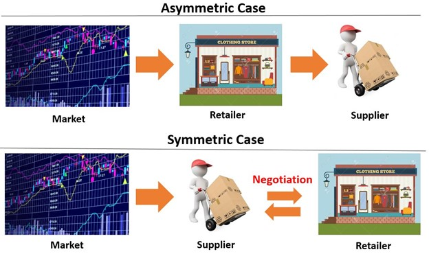

# Minimizing Retail Costs through Cooperation in a Supply Chain

<strong> Abstract: </strong>
It is in the interest of any company that sells a product to minimize shipping, ordering, and storage costs. One factor in reducing costs is to find an optimal replenishment strategy to meet market demand. We explore here the difference between a retailer acting independently versus cooperating with its supplier in a two-chain supply management problem. In this paper, a startup retailer and supplier selling shirts negotiate their optimal replenishment strategy. Acting independently, the total cost for the retailer and supplier is \$11,142 and \$7,632.00, respectively. However, if the two companies work together the costs are \$11,542 and \$6,378, respectively. The supplier can then offer a side payment of \$400 dollars to cover the increase in the retailers cost while decreasing its own by \$854 overall with the negotiated strategy. The optimization problem discussed is a binary integer linear problem since the retailer and supplier have the option to place or not to place an order each month. In order to solve for the optimal replenishment plan we developed a program that reduces the BILP to an LP and solves the LP over all combinations of ordering plans. A comparison between the independent case and the cooperation case was performed. PuLP, a python based solver is used to solve the LPs. For a time period of 3 months, 16 LPs were solved for the independent case and 64 LPs were solved in the cooperation case. Future work would include generalizing the optimization setup and program to account for other goods such as food which are perishable as well as discounts from buying in bulk. 

